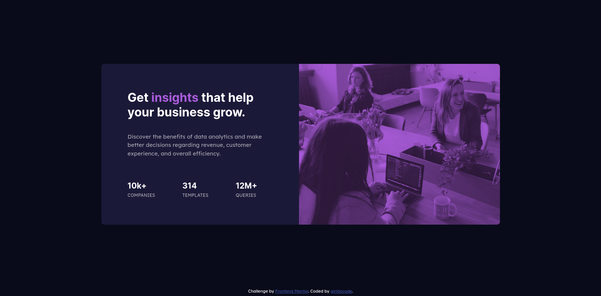

# Frontend Mentor - Results summary component solution

This is a solution to the [Product preview card component challenge on Frontend Mentor](https://www.frontendmentor.io/challenges/stats-preview-card-component-8JqbgoU62). Frontend Mentor challenges help you improve your coding skills by building realistic projects.

## Table of contents

- [Overview](#overview)
  - [The challenge](#the-challenge)
  - [Screenshot](#screenshot)
  - [Links](#links)
- [My process](#my-process)
  - [Built with](#built-with)
  - [What I learned](#what-i-learned)
  - [Continued development](#continued-development)
  - [Useful resources](#useful-resources)
- [Author](#author)

## Overview

### The challenge

Users should be able to:

- View the optimal layout for the interface depending on their device's screen size
- See hover and focus states for all interactive elements on the page
- **Bonus**: Use the local JSON data to dynamically populate the content

### Screenshot

### Links

- Solution URL: (https://github.com/girldocode/product-card-fr-mentor)
- Live Site URL: (https://stats-preview-fr-mentor.vercel.app/)

## My process

### Built with

- HTML5
- CSS
- Flexbox
- Mobile responsive 

### What I learned

...

### Continued development

...

### Useful resources

- [MDN](https://developer.mozilla.org/en-US/)
- [Stackoverflow](https://stackoverflow.com/)

## Author

- Website - [website is comming...]()
- Frontend Mentor - [@girldocode](https://www.frontendmentor.io/profile/girldocode)
- Twitter - [@girldocode](https://www.twitter.com/girldocode)